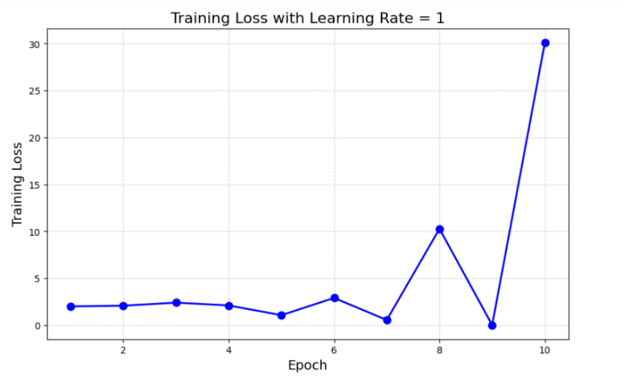
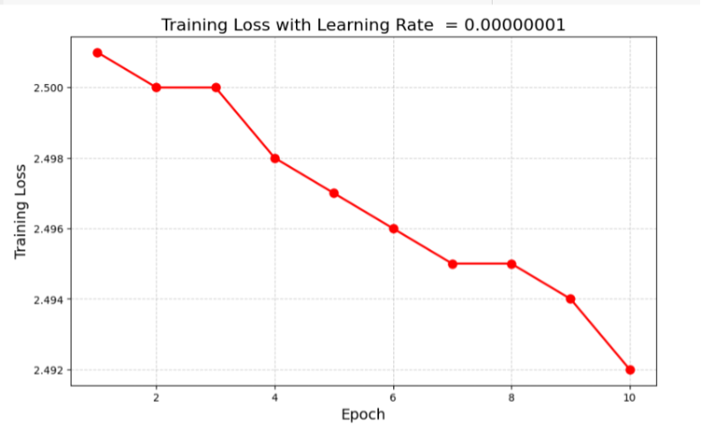
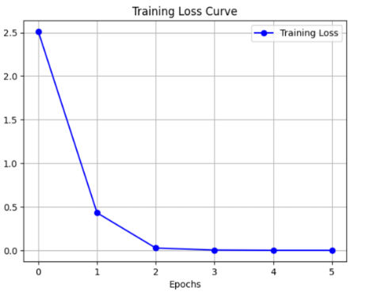
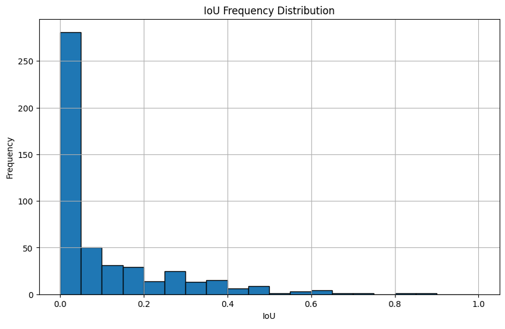
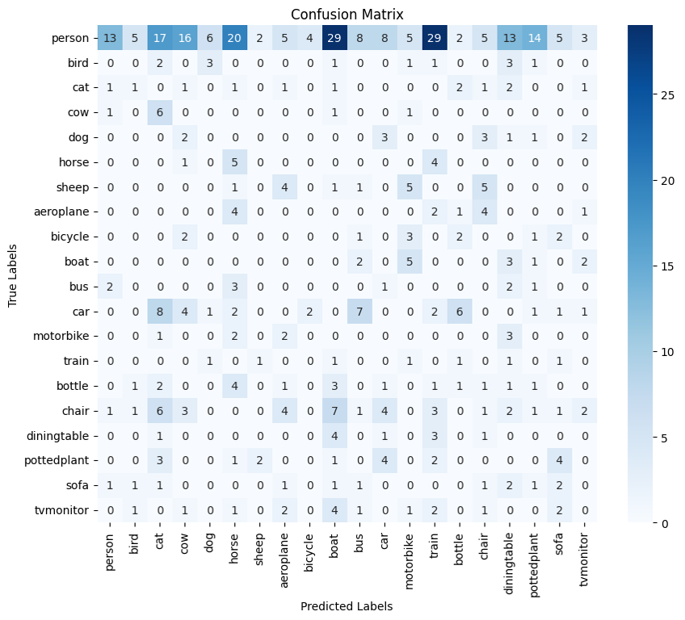

# YOLOv1 Object Detection on Pascal VOC 2012

This project implements a simplified version of the YOLOv1 object detection model, applied to the PASCAL VOC 2012 dataset. It involves converting annotation formats, training with limited computational resources, and analyzing results from a deep learning pipeline implemented in Google Colab.

---

## 📌 Project Highlights

* Implemented object detection using **YOLOv1** and **ResNet18** as backbone
* Dataset: **PASCAL VOC 2012** with 20 annotated object categories
* Full pipeline includes **data preprocessing**, **label conversion**, **model building**, **training**, **evaluation**, and **visualization**
* Trained on Google Colab using pre-trained weights and fine-tuning strategies
* Evaluation metrics include **Accuracy**, **Precision**, **Recall**, **IoU**, and **Loss Curve**

---

## 🧬 Dataset

* **PASCAL VOC 2012**: 15,000+ manually labeled images with 20 common object classes (cat, dog, car, etc.)
* Data augmentation and format conversion performed to adapt to YOLO input requirements
* Labels converted from **XML** to **YOLO TXT format** and normalized to \[0, 1]

---

## 🔧 Model & Training Details

* Backbone: **ResNet18**, modified to output 64 channels
* Image input size: **448 x 448**
* Activation: **LeakyReLU**
* Optimizer: SGD with learning rate = 0.01, weight decay = 1e-4
* Training:

  * Pre-trained on 500 images for 20 epochs
  * Fine-tuned on 300 images for 5 epochs
* Loss function: Custom YOLO loss (bounding box + object confidence + classification)

---

## 🔍 Hyperparameter Experiments

### Learning Rate Too High (LR=1):

Training became unstable and diverged after a few epochs.



### Learning Rate Too Low (LR=1e-8):

Training was extremely slow and failed to converge meaningfully.



### Final Training Loss Curve:

Demonstrates that the model was able to converge when using appropriate learning rate and training strategy.



---

## 📊 Evaluation Results

### IoU Frequency Distribution:

Majority of predicted bounding boxes had low IoU scores, indicating poor localization. A small number showed moderate overlap.



### Confusion Matrix:

Model exhibited low per-class accuracy, with many misclassifications and confusion among similar classes (e.g., person vs. boat).



---

## 🚧 Limitations & Future Work

* Limited compute (Google Colab) led to reduced model depth and fewer training epochs
* Training used a small portion of the full VOC dataset
* Future improvements:

  * Use larger networks with more channels
  * Train on full VOC or COCO dataset
  * Use transfer learning from better pre-trained models
  * Optimize loss function with cross-entropy for classification
  * Improve visualization and evaluation with better bounding box prediction

---

## 📁 File Structure

```
yolo-voc-detection/
├── README.md                   # This file
├── img/
│   ├── lr1_loss.png
│   ├── lr1e-8_loss.png
│   ├── final_loss_curve.png
│   ├── iou_histogram.png
│   └── confusion_matrix.png
├── Final_Report.pdf            # Full project report
├── Yolo_Processing.ipynb       # YOLO data preprocessing & training code
```

---

## 🔗 References

1. Redmon, J. et al. (2016). YOLO: You Only Look Once. CVPR. [http://pjreddie.com/yolo/](http://pjreddie.com/yolo/)
2. Shetty, S. (2012). Image Classification with CNN on Pascal VOC. MIT.
3. Author(s) (2020). YOLO Development Overview. ITQM.
4. Weishuo (2024). YOLOv1 Code Reproduction, CSDN Blog.

---

**Author:** Yuanyuan Chen
**Date:** March 2025
**University of Limerick**
